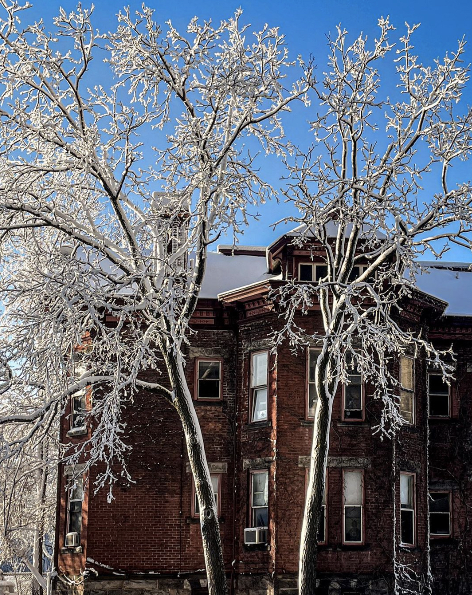
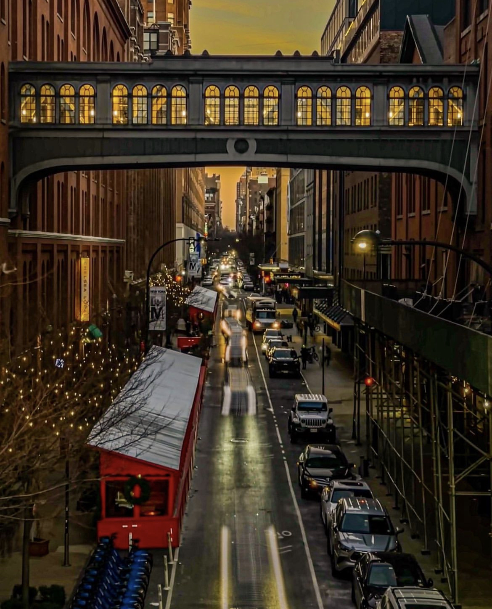
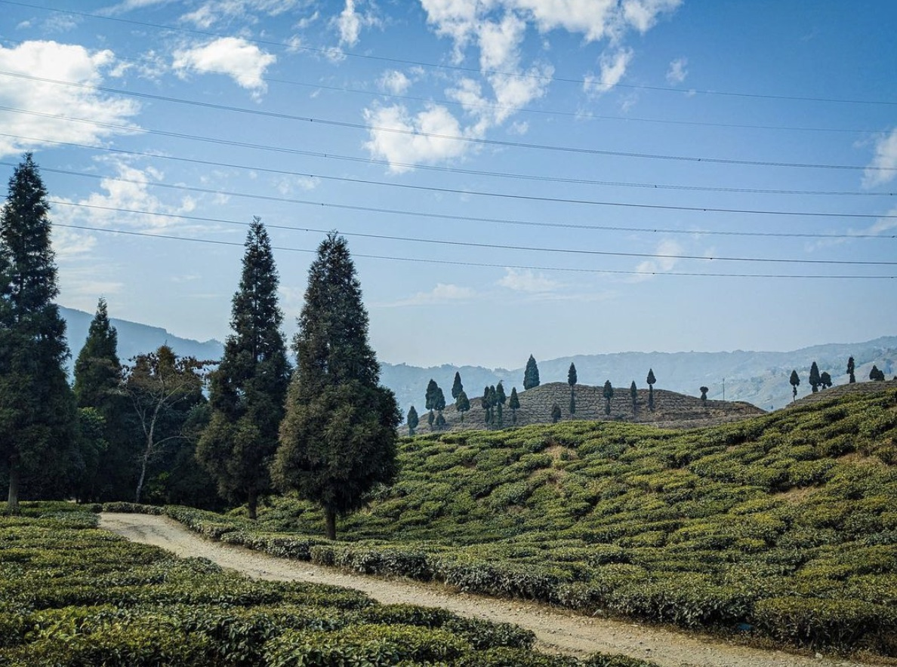

```{=html}
<style>
body {
text-align: justify}
</style>
```
I used to sketch and take photographs on my [Canon 600D](https://www.canon.co.uk/for_home/product_finder/cameras/digital_slr/eos_600d/) in college but as is the case with a lot of students, those took a backseat once I started graduate school. One of my 2022 resolutions was to try and pursue things outside my research that excite me just as much. You can find recent sketches and photographs on my [Instagram profile](https://www.instagram.com/penguinhologram/) - hope you like them!

::: columns
::: {.column width="49%"}
<center>
<p>{width="970" height="600"}</p></center>
:::

::: {.column width="2%"}
:::

::: {.column width="49%"}
<center>
<p>{width="970" height="600"}</p></center>

:::
:::

<center>
<p>{width="970" height="600"}</p></center>


